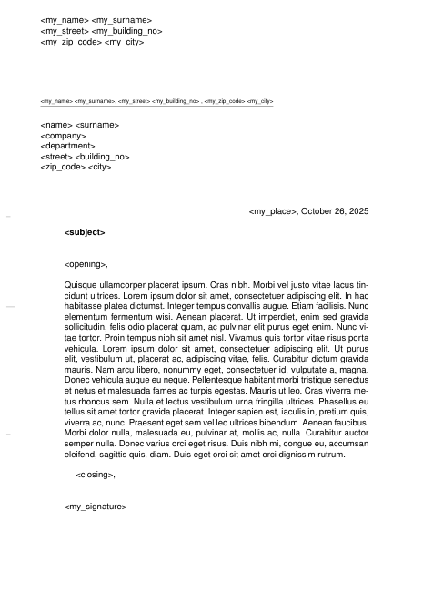

# A simple letter template for LaTeX

## How To

Override the placeholders (`<placeholder>`) inside `main.tex` with your own data and create a new document inside `content/<document_name>.tex`.

To build the PDF document, which is generated in `build/<document_name>.pdf`, run:
```sh
make doc=<document_name>
```

If the `doc` cli parameter isn't specified it defaults to `template` – a simple showcase document:



## Misc

Options and configuration of the document are set inside `main.tex`. To change default behavior, change or uncomment them. The most important ones IMO:

| Option (default)               | Description                                                          |
|--------------------------------|----------------------------------------------------------------------|
| `firstfoot=false`              | Disable footer on first page                                         |
| `fromurl=false`                | Hide `<my_url>` from sender header                                   |
| `fromemail=false`              | Hide `<my_email>` from sender header                                 |
| `fromphone=false`              | Hide `<my_phone_no>` from sender header                              |
| `fromrule=false`               | Hide horizontal ruler dividing sender header from rest               |
| `%\usepackage[ngerman]{babel}` | Commented out – uses English locale; Uncomment to use German locale  |
| `%\LoadLetterOption{DIN}`      | Commented out; uncomment to use DIN letter                           |

---

Sources: <https://mirrors.ctan.org/macros/latex/contrib/koma-script/doc/scrguide-en.pdf>
